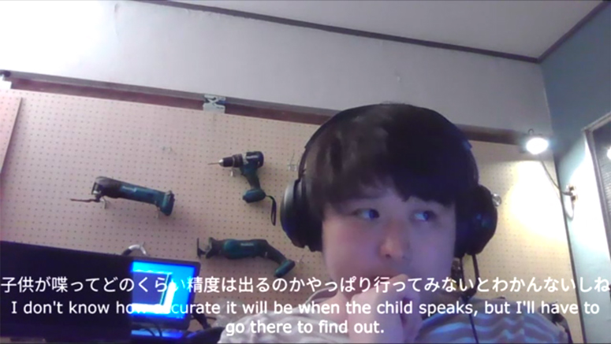

# Automatic translation Test

Google Cloud Speech-to-Text と DeepLを使用して、リアルタイムに音声→テキスト→翻訳するテスト。

ZOOMなどに映像を流すために、OSCでテキストと翻訳結果をtouchDesigner/Telop.toeに送信して、カメラ映像にテロップとして被せる。

## 動作環境
* Win10
* SoX
* Node.js
* TouchDesigner



見ての通りそんなにうまくいっていない。
しゃべりだしや相づちとかが苦手のよう。

# Setup

## 1. ライセンス作る。

### DeepL のライセンスを下記フォーマットでconfig.jsonとして保存
```config.json
{
  "deepl": {
    "API_ENDPOINT": "https://api.deepl.com/v2/translate",
    "AUTH_KEY": "**********************************"
  }
}
```


### Google Cloud Speech-to-Text API のライセンスを下記フォーマットでlicense.jsonとして保存
```license.json
{
  "type": "service_account",
  "project_id": "**************",
  "private_key_id": "******************************************",
  "private_key": "******************************************",
  "client_email": "******************************************",
  "client_id": "******************************************",
  "auth_uri": "https://accounts.google.com/o/oauth2/auth",
  "token_uri": "https://oauth2.googleapis.com/token",
  "auth_provider_x509_cert_url": "https://www.googleapis.com/oauth2/v1/certs",
  "client_x509_cert_url": "******************************************"
}
```

## 2. Soxインストール
sox-14.4.1a-win32.exe を実行

パスを通しておく。

14.4.2だとエラー出てうまくいかなかった。

## 3. Nodeの実行
```angular2html
$ npm i
$ npx ts-node node/index.ts
```